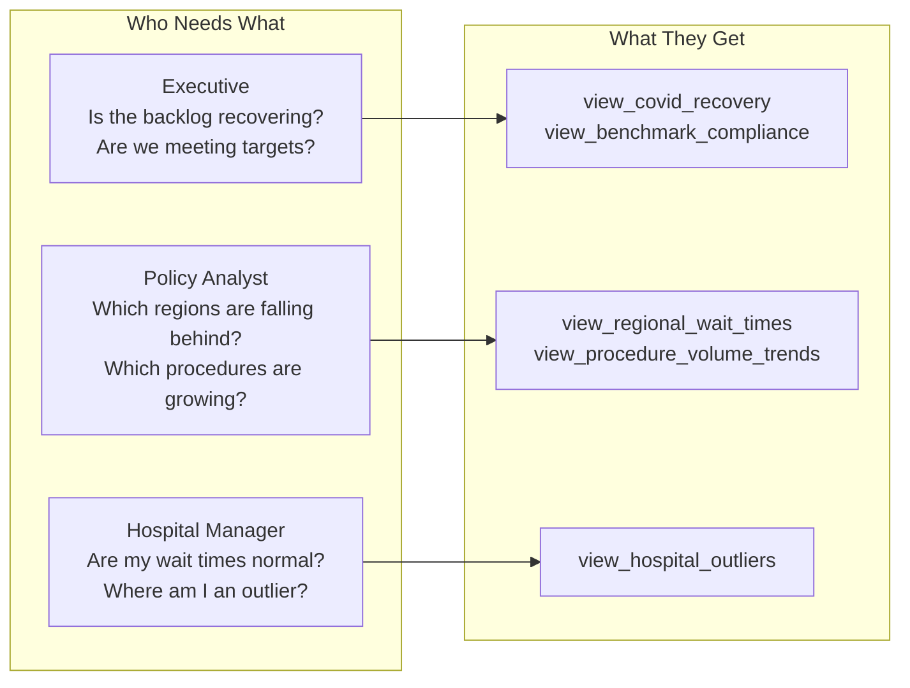
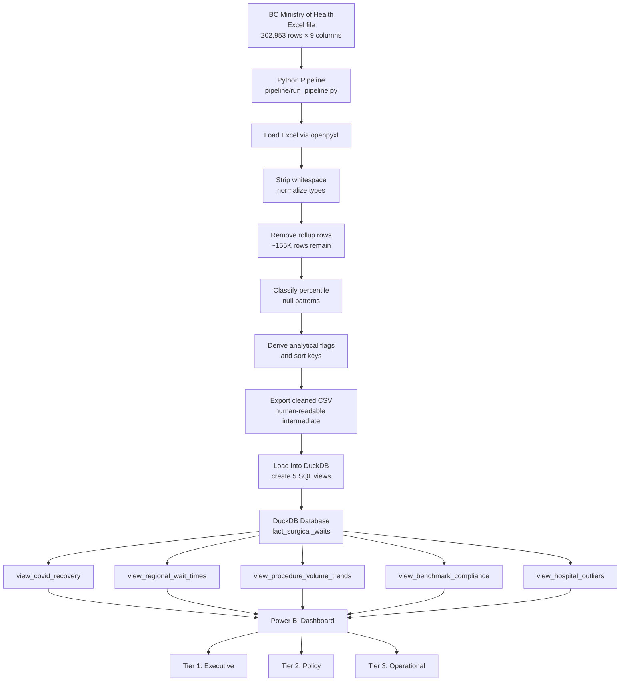
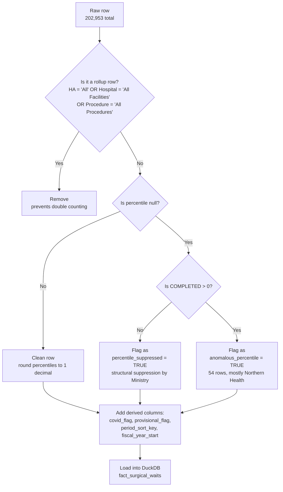
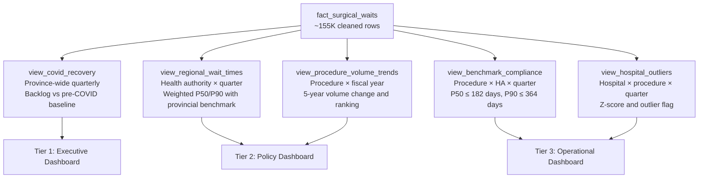

<div align="center">

# BC Surgical Wait Times

*A portfolio project that started with "just clean the data and make a dashboard" and ended with documented assumptions, disclosed limitations, and a question about what it actually means to trust a number.*

[](https://github.com/Sahibjeetpalsingh/bc-surgical-wait-times)
[](https://github.com/Sahibjeetpalsingh/bc-surgical-wait-times)
[](https://github.com/Sahibjeetpalsingh/bc-surgical-wait-times)
[](LICENSE)

</div>

<br>

## See the Dashboard

<p align="center">
  
</p>

Four million surgeries completed. Five million patients still waiting. A median wait of 8.62 days that sounds reasonable until you see the P90 sitting at 22.30 days, meaning the longest waiting 10% of patients wait nearly three times longer than the median. That spread is where the real story lives, and it is the thing a simple average would have hidden completely.

<br>

---
## Key Findings

The provincial surgical backlog has not recovered from COVID. Total patients waiting remains above the FY2018/19 pre-COVID baseline, and the gap between waiting and completed volumes has widened steadily since 2009/10. Every single health authority shows more patients waiting than being completed on average, meaning no region is currently drawing down its backlog. Vancouver Coastal carries the highest absolute volumes, while Northern Health has the lowest, though that reflects population size, not better access. The most revealing number is the spread between P50 (8.62 days) and P90 (22.30 days): the median looks manageable, but the longest waiting 10% of patients wait nearly three times longer, and that tail is invisible in any summary that reports only the average. FY2024/25 figures are provisional and should be treated as preliminary.

## The Starting Point: A Question, Not a Dataset

Most data projects start with a dataset and ask "what can I find?" This one started differently. I wanted to understand a specific thing: **why are surgical wait times in British Columbia not improving, and who is affected most?**

BC's Ministry of Health publishes quarterly surgical wait time data going back to FY2009/10. The dataset is public. It covers 66 hospitals, 85 procedure groups, and all six regional health authorities. On paper it is exactly what you need to answer that question.

In practice the raw Excel file is not analysis ready. It contains pre-aggregated rollup rows that cause double counting if you sum them. Over a third of the percentile values are missing. Categories are inconsistent. There is no built-in way to compare regions fairly, track whether COVID recovery is actually happening, or flag hospitals that fall outside normal ranges.

So before writing any code, I sat down and asked the questions a senior analyst would ask before touching a dataset.

<br>

---

## Chapter 1: Before the Code, the Thinking

### Who is this for?

Not every audience needs the same number. A health authority executive deciding where to allocate surgical funding needs a province-wide backlog trend. A policy analyst evaluating whether a region is falling behind needs a regional comparison with a provincial benchmark. A hospital manager trying to figure out why their orthopedic wait times spiked last quarter needs procedure-level drill-down by facility.

I designed the pipeline around three audiences from the start, because the audience determines which metrics matter, how granular the data needs to be, and what filters the dashboard requires.



### What does "wait time" actually mean here?

This is the question most analysts skip. The dataset contains two percentile columns: P50 (median) and P90 (90th percentile). But these measure **completed case** wait times only. That means they count the time from when a patient was added to the wait list to when their surgery actually happened.

Patients who are still waiting are invisible.

That distinction matters enormously. If a hospital clears its shortest-wait patients first, its P50 improves on paper while the longest waiters continue accumulating. The numbers look better. The experience for the hardest cases gets worse. Every chart in this project carries that caveat.

### What is broken in the data before I touch it?

I opened the raw file and looked for problems before doing anything else. Here is what I found.

| Problem | Scale | Why it matters |
|:---|:---|:---|
| Pre-aggregated rollup rows mixed in with facility-level rows | Thousands of rows | Summing without removing them causes double counting |
| 36.4% of percentile values are null | ~74,000 cells | Not errors. BC suppresses percentiles when completed cases fall below roughly 5. Stable across all 16 years. |
| 54 rows where COMPLETED > 0 but percentile is still null | 54 rows | These do not fit the suppression pattern. Concentrated in specific Northern Health procedures. Flagged separately. |
| "All Other Procedures" category declining over time | Affects trend analysis | The decline is not real. It reflects procedures being reclassified into named groups over the years. Including it in trend analysis would show a fake decrease. |
| FY2024/25 data was incomplete at time of file publication | Most recent year | File was last modified March 8, 2025. Q4 2024/25 was not final. Every chart using this year needs a provisional flag. |

> **The point of this step:** Every one of these problems would silently corrupt the analysis if I had jumped straight to cleaning. The rollup rows would inflate totals. The null percentiles would bias regional averages toward high-volume facilities. The "All Other Procedures" trend would mislead anyone looking at volume changes. Knowing what is broken and *why* it is broken determines the correct fix.

<br>

---

## Chapter 2: Five Questions, Not "Exploratory Analysis"

I did not run the data through a notebook and see what patterns emerged. I defined five specific questions before writing the first query, because a question without a comparison is just a number, and a number without context does not help anyone make a decision.

Each question has a built-in benchmark or comparison. Each one maps to a specific audience. Each one became a dedicated SQL view.

| # | Question | Comparison | Audience | View |
|:---:|:---|:---|:---|:---|
| Q1 | Is BC's surgical backlog recovering post-COVID? | Current quarter vs FY2018/19 pre-COVID baseline | Executive | `view_covid_recovery` |
| Q2 | Which health authorities have the longest median wait times? | Each region vs provincial average | Policy | `view_regional_wait_times` |
| Q3 | Which procedures have the most patients waiting, and is that changing? | Current volume vs same procedure five years ago | Policy | `view_procedure_volume_trends` |
| Q4 | Are high-volume procedures meeting BC's wait time benchmarks? | P50 vs 182-day target, P90 vs 364-day target | Operational | `view_benchmark_compliance` |
| Q5 | Which hospitals are statistical outliers for a given procedure? | Hospital P50 vs provincial mean, measured in standard deviations | Operational | `view_hospital_outliers` |

> **Why this matters:** "Average wait time went up 12%" means nothing without a comparison. Compared to what? Last year? The provincial target? A peer region? Every metric in this project is paired with a benchmark so the number tells a story, not just states a fact.

<br>

---

## Chapter 3: The Pipeline, Cleaning With Documented Reasoning

### Architecture



### How Each Row Gets Classified

Not every row gets the same treatment. The pipeline does not blindly drop nulls or fill missing values. It asks *why* each problem exists and applies a different fix based on the answer.



### The Ten Cleaning Decisions

Every decision is documented with reasoning and the conditions under which it should be revisited. Full detail is in `docs/assumptions_log.md`. Here is the summary.

| ID | Decision | Why, not just what |
|:---:|:---|:---|
| A1 | Remove rollup rows using OR logic across all three sentinel values | Any partially aggregated row causes double counting. AND logic would miss partial rollups. |
| A2 | Treat the 36.4% null percentiles as structural suppression, not errors | BC suppresses percentiles when completed cases fall below roughly 5. The null rate is stable across all 16 years with no temporal drift. This is policy, not data quality failure. |
| A3 | Flag 54 anomalous rows separately where COMPLETED > 0 but percentile is null | These do not fit the suppression pattern. They are concentrated in specific Northern Health procedures. They need separate investigation, not the same label. |
| A4 | COVID flag covers FY2020/21 and FY2021/22 only. Q4 2019/20 is excluded. | Flagging Q4 2019/20 would contaminate the FY2018/19 pre-COVID baseline used as the comparison throughout the analysis. The baseline has to be clean. |
| A5 | FY2024/25 flagged provisional for the entire fiscal year | The source file was last modified March 8, 2025. BC routinely revises prior quarters in subsequent releases. Treating this year as final would be misleading. |
| A6 | "All Other Procedures" excluded from trend and compliance views | Its apparent volume decline reflects procedures being reclassified into named groups over time, not a real decrease. Including it would show a trend that does not exist. |
| A7 | Volume-weighted average of P50 used as regional aggregate | A true median requires individual patient records that this dataset does not contain. Volume-weighted average is the closest valid approximation with pre-computed percentiles. It is an approximation and is labeled as such. |
| A8 | 2-sigma threshold (z > 2.0) for hospital outlier classification | Standard healthcare benchmarking convention. 1.5σ over-flags small hospital variance. 3σ misses systemic issues. |
| A9 | Percentile columns rounded to 1 decimal place | Corrects floating point representation artifacts from Excel without discarding clinically relevant sub-day precision. |
| A10 | High-volume procedures defined as top quartile by WAITING in FY2023/24 | A relative quartile threshold is stable as system volume changes. A fixed count threshold would need manual updating every year. |

> **Why document this level of detail?** Because every one of these decisions can be challenged by someone reviewing the work. "Why did you exclude those rows?" "How did you define high-volume?" "Why 2-sigma and not 3?" The assumptions log exists so every answer is already written down before the question is asked.

<br>

---

## Chapter 4: What the Data Actually Shows

### The backlog has not recovered from COVID.

<p align="center">
  
</p>

The bottom trend line tells the clearest story. Both waiting and completed volumes have been climbing since FY2009/10, but waiting has grown faster. The two lines diverge steadily, with a visible disruption during COVID years (2020/21 and 2021/22) where completions dropped sharply due to policy-driven surgical deferrals. Post-COVID, completions recovered but the gap between waiting and completed did not close. As of FY2024/25 (provisional), the province has approximately 5 million cumulative patients who have been on a wait list and 4 million cumulative completed surgeries. The backlog is not being drawn down. It is being maintained.

### Every health authority has more patients waiting than being completed on average.

<p align="center">
  
</p>

Vancouver Coastal carries the highest average volumes for both waiting and completed cases, followed by Vancouver Island and Fraser. Northern Health has the lowest volumes, but that reflects population size, not necessarily better access. The critical observation is that in every single region, the red bar (waiting) exceeds the green bar (completed). No health authority is currently completing surgeries faster than new patients are being added to the wait list.

### The spread between P50 and P90 reveals the real access problem.

The median wait (P50) is 8.62 days. That sounds manageable. But the P90 is 22.30 days, meaning the longest waiting 10% of patients wait nearly three times as long as the median patient. A system that reports "median wait under 9 days" is technically accurate and practically misleading, because the patients who are struggling most are invisible in that number.

### Waiting and completed both trend upward, but the gap widens.

Since FY2009/10, both lines have climbed. But waiting has climbed faster than completed. The system is doing more surgeries every year, but demand is growing even faster. Without a structural change in capacity, the backlog will continue to grow regardless of how many surgeries are completed in any given quarter.

<br>

---

## Chapter 5: What This Data Cannot Tell You

This section exists because a senior analyst presents limitations alongside findings, not hidden in a footnote. Every one of these limitations affects how the numbers should be interpreted.

| # | Limitation | What it means in practice |
|:---:|:---|:---|
| L1 | P50 and P90 measure completed case wait times only | Patients still on the wait list are invisible. A hospital could improve its percentiles by clearing short-wait cases first while long waiters continue to accumulate. The numbers can look better while the experience for the hardest cases gets worse. |
| L2 | 36.4% of percentile values are suppressed | Regional averages are computed only from facilities with enough volume to report. Smaller facilities are excluded. True system-wide wait times are likely understated. |
| L3 | Urgency mix is not captured | A facility that receives mostly urgent transfers will show shorter waits on paper. Comparing two hospitals without knowing their urgency mix is descriptive only, not causal. |
| L4 | COVID years are not comparable to other years | FY2020/21 and FY2021/22 reflect policy-driven surgical deferrals, not normal system performance. Trend lines that cross this period without annotation are misleading. |
| L5 | FY2024/25 is provisional | The most recent fiscal year was not finalized at time of file publication. Figures should be treated as preliminary. |
| L6 | Volume-weighted average is not a true median | The regional P50 figures in this analysis are approximations. They may differ from a true population median computed from individual patient records. |
| L7 | Z-score outlier method assumes a normal distribution | Healthcare wait times are right-skewed. Low-volume hospitals may appear as outliers due to statistical variance rather than actual performance differences. |
| L8 | No population denominator | Per-capita or age-standardized rates cannot be computed. Volume comparisons across regions with different population sizes are descriptive only. |
| L9 | No outcome data | This analysis measures access to surgery, not quality of surgery. Shorter wait times do not necessarily mean better outcomes. |
| L10 | Coding variation across facilities | Different facilities may apply different conventions for when a patient's wait-list entry date starts and how procedures are classified. |

> **Why put this in the README?** Because the fastest way to lose credibility with a stakeholder is to present a finding that falls apart under the first question. "Did you account for the fact that those percentiles only cover completed cases?" If the answer is buried in an appendix nobody reads, the trust is already broken. Putting it front and center signals that the analysis was built with the hard questions already considered.

<br>

---

## Chapter 6: The SQL Views, Built for Reuse

The five views sit on top of a single fact table (`fact_surgical_waits`, ~155K rows). They are designed so the next analyst or the next question does not require rebuilding the pipeline from scratch.

### How the views connect to the dashboard



### `view_covid_recovery`
**Question:** Is BC's surgical backlog recovering post-COVID, and how does the current quarter compare to the pre-COVID baseline?

Province-wide, quarterly granularity. Includes all rows (even those with suppressed percentiles) because this view tracks volume, not wait duration. Key columns include `total_waiting`, `total_completed`, `completion_rate_pct`, and `waiting_vs_baseline_pct` which measures the current quarter's waiting volume against the average quarterly waiting in FY2018/19.

### `view_regional_wait_times`
**Question:** Which health authorities have the longest median wait times, and is the gap between regions widening or narrowing?

Health authority by quarter granularity. Filters out suppressed percentiles before aggregating. Key columns include `weighted_avg_p50`, `provincial_p50`, and `gap_vs_provincial_p50_days`. A positive gap means that region's patients wait longer than the provincial average.

Caveat: the weighted average P50 is not a true statistical median. See limitation L6.

### `view_procedure_volume_trends`
**Question:** Which procedure types have the highest patient volumes currently waiting, and how has that changed over five years?

Procedure group by fiscal year granularity. Excludes "All Other Procedures" because its decline reflects reclassification, not real volume change (see decision A6). Key columns include `annual_waiting`, `waiting_5yr_change_pct`, and `rank_by_waiting`.

### `view_benchmark_compliance`
**Question:** Are high-volume procedures meeting BC's provincial wait time benchmarks?

Procedure by health authority by quarter granularity. Scoped to top-quartile procedures by waiting volume in FY2023/24 (see decision A10). Benchmarks are P50 ≤ 182 days (26 weeks) and P90 ≤ 364 days (52 weeks). Key columns include `p50_compliant`, `p90_compliant`, and `fully_compliant`.

### `view_hospital_outliers`
**Question:** Which hospitals are statistical outliers against the provincial average for the same procedure and quarter?

Hospital by procedure by quarter granularity. Uses a 2-sigma threshold (see decision A8). Key columns include `z_score_p50`, `outlier_flag`, and `outlier_direction`.

Caveat: always filter by `total_waiting > N` before interpreting outlier results. Small-volume hospitals generate extreme z-scores due to statistical variance, not systemic performance differences. See limitation L7.

<br>

---

## The Dataset

**Publisher:** BC Ministry of Health
**Dataset:** Surgical Wait Times, Quarterly
**Format:** Excel (.xlsx)
**Coverage:** FY2009/10 through FY2024/25 (16 years, quarterly)

| Dimension | Coverage |
|:---|:---|
| Source rows | 202,953 |
| Rows after cleaning | ~155,000 (rollup rows removed) |
| Health authorities | 7 (Fraser, Interior, Northern, PHSA, Vancouver Coastal, Vancouver Island + provincial aggregate) |
| Hospitals | 66 |
| Procedure groups | 85 |

### Source Columns

| Column | Type | Nullable | What it actually measures |
|:---|:---:|:---:|:---|
| `FISCAL_YEAR` | String | No | BC fiscal year label, e.g. "2023/24" (April through March) |
| `QUARTER` | String | No | Q1 (Apr to Jun), Q2 (Jul to Sep), Q3 (Oct to Dec), Q4 (Jan to Mar) |
| `HEALTH_AUTHORITY` | String | No | One of six regional HAs or a provincial aggregate |
| `HOSPITAL_NAME` | String | No | Specific facility or "All Facilities" aggregate |
| `PROCEDURE_GROUP` | String | No | One of 85 surgical procedure categories |
| `WAITING` | Integer | No | Patients on the wait list at quarter end. This is a snapshot, not cumulative. |
| `COMPLETED` | Integer | No | Surgeries completed within that quarter |
| `PERCENTILE_COMP_50TH` | Float | Yes | Median days from wait-list entry to surgery. Completed cases only. |
| `PERCENTILE_COMP_90TH` | Float | Yes | 90th percentile days. Completed cases only. |

### Derived Columns (added by pipeline)

| Column | Type | How it is derived |
|:---|:---:|:---|
| `fiscal_year_start` | Integer | First four characters of FISCAL_YEAR cast to integer. "2023/24" becomes 2023 |
| `quarter_number` | Integer | Q1 becomes 1, Q2 becomes 2, Q3 becomes 3, Q4 becomes 4 |
| `period_sort_key` | Integer | fiscal_year_start × 10 + quarter_number. Enables correct chronological ordering without string parsing. |
| `covid_flag` | Boolean | TRUE where fiscal_year_start is 2020 or 2021 |
| `provisional_flag` | Boolean | TRUE where FISCAL_YEAR is "2024/25" |
| `percentile_suppressed` | Boolean | TRUE where PERCENTILE_COMP_50TH is null. Structural suppression by Ministry, not imputed. |
| `anomalous_percentile` | Boolean | TRUE where COMPLETED > 0 and PERCENTILE_COMP_50TH is null. Distinct from structural suppression. |

<br>

---

## Project Structure

```
bc-surgical-wait-times/
│
├── data/                          Not tracked in version control
│   ├── raw/                       Source Excel file from BC Ministry of Health
│   ├── interim/                   Cleaned CSV (generated by pipeline)
│   └── processed/                 DuckDB database (generated by pipeline)
│
├── pipeline/
│   └── run_pipeline.py            End-to-end pipeline orchestrator
│
├── sql/
│   └── views/
│       ├── view_covid_recovery.sql
│       ├── view_regional_wait_times.sql
│       ├── view_procedure_volume_trends.sql
│       ├── view_benchmark_compliance.sql
│       └── view_hospital_outliers.sql
│
├── powerbi/
│   └── Healthline.pbit            Power BI template file
│
├── docs/
│   ├── images/
│   │   ├── dashboard_full.png     Full dashboard screenshot
│   │   └── regional_comparison.png Regional bar chart
│   ├── data_dictionary.md         Column definitions, domain glossary, view documentation
│   ├── assumptions_log.md         Every analytical decision with reasoning
│   ├── limitations_disclosure.md  What this data cannot answer
│   ├── pipeline_runbook.md        How to update for new quarterly releases
│   └── inspection_log.md          Auto-generated data profile from initial load
│
├── .gitignore
├── requirements.txt
└── README.md
```

<br>

---

## How to Reproduce

### 1. Install dependencies

```bash
pip install -r requirements.txt
```

Requires Python 3.10 or later.

### 2. Obtain the source data

Download the latest quarterly surgical wait times Excel file from BC's Ministry of Health and place it at:

```
data/raw/2009_2025-quarterly-surgical_wait_times-final.xlsx
```

The `data/` directory is not tracked in version control. Create it locally.

### 3. Run the pipeline

```bash
python -m pipeline.run_pipeline
```

The pipeline will load the Excel file, report the raw row count, remove rollup rows (down to ~155K), classify null patterns, derive analytical flags, export a cleaned CSV to `data/interim/`, create the DuckDB database at `data/processed/`, and execute all five SQL view definitions.

### 4. Validate (optional)

```sql
duckdb data/processed/surgical_wait_times.duckdb

SELECT fiscal_year, quarter, total_waiting, total_completed
FROM view_covid_recovery
ORDER BY period_sort_key;

SELECT health_authority, fiscal_year, quarter,
       weighted_avg_p50, gap_vs_provincial_p50_days
FROM view_regional_wait_times
WHERE fiscal_year = '2023/24'
ORDER BY gap_vs_provincial_p50_days DESC;
```

### 5. Open Power BI

Open `powerbi/Healthline.pbit` in Power BI Desktop. When prompted for the data source path, provide the absolute path to `data/processed/surgical_wait_times.duckdb`. Requires the [DuckDB ODBC driver](https://duckdb.org/docs/api/odbc/overview). Refresh all queries.

<br>

---

## Updating for New Quarterly Releases

When BC publishes a new quarterly file:

1. Replace the file in `data/raw/` with the new release
2. Verify the source schema still has the expected nine columns
3. Update `PROVISIONAL_FISCAL_YEAR` in the pipeline if a new fiscal year has become final
4. Rerun `python -m pipeline.run_pipeline`
5. Refresh Power BI

Full procedure including schema checks, validation queries, and troubleshooting is documented in `docs/pipeline_runbook.md`.

<br>

---

## Tech Stack

| Layer | Technology | Why this, not something else |
|:---|:---|:---|
| **Data ingestion and cleaning** | Python 3.10+, pandas, openpyxl | pandas handles the messy Excel parsing and type normalization. openpyxl reads the .xlsx format directly. |
| **Analytical database** | DuckDB | Embedded, no server setup, reads directly from pandas DataFrames, SQL dialect is clean, and Power BI connects via ODBC. |
| **SQL views** | DuckDB SQL | Views sit on top of the fact table so the next question does not require rebuilding anything. |
| **Dashboard** | Power BI Desktop | Required for the healthcare analyst role this project targets. Supports drill-down, slicers, and tiered page navigation. |
| **Documentation** | Markdown | Lives in the repo, version controlled, readable on GitHub without any extra tools. |

<br>

---

## Documentation Index

| File | What it contains and why it exists |
|:---|:---|
| `docs/data_dictionary.md` | Full column definitions, domain glossary, and view documentation. Exists so every metric means the same thing to every reader. |
| `docs/assumptions_log.md` | All ten cleaning decisions with reasoning and the conditions under which each should be revisited. Exists so every decision can be defended. |
| `docs/limitations_disclosure.md` | What this data cannot answer, organized by chart type so each visual carries the right caveats. Exists because presenting findings without limitations is dishonest. |
| `docs/pipeline_runbook.md` | Step-by-step guide for updating with new quarterly releases, including schema checks and constants to update. Exists so someone else can maintain this without reverse engineering the code. |
| `docs/inspection_log.md` | Auto-generated data profile from the initial load. Exists as a baseline so future runs can be compared against it to catch schema drift. |

<br>

---

## What I Would Do Differently

If I had access to individual patient-level records instead of pre-aggregated quarterly data, three things change immediately.

First, I would compute true medians instead of volume-weighted approximations. The current P50 figures are the best I can do with the data available, but they are approximations and I have labeled them as such throughout. With patient records, that caveat disappears.

Second, I would segment by urgency level. Right now, a facility that receives mostly urgent transfers shows shorter waits on paper, making it look better than a facility handling primarily elective cases. Without urgency data, cross-facility comparisons are descriptive only. With it, they become actionable.

Third, I would build a forecasting layer. The current analysis describes what happened and what is happening now. It does not predict what will happen next quarter. With patient-level data including referral dates, procedure types, and facility capacity, a time-series model could flag procedures and regions likely to breach benchmark thresholds before they actually do, giving planners time to respond instead of react.

The current dataset measures access at a system level. The real operational decisions happen at the patient and surgeon level. That requires data this file does not contain, and acknowledging that boundary is part of doing the analysis honestly.

<br>

---

<div align="center">

**Sahibjeet Pal Singh**

[GitHub](https://github.com/Sahibjeetpalsingh) · [LinkedIn](https://linkedin.com/in/sahibjeet-pal-singh-418824333) · [Portfolio](https://your-portfolio-url.com)

*Built as a portfolio project to demonstrate end-to-end healthcare analytics: from raw public data to documented, stakeholder-ready reporting.*

</div>
