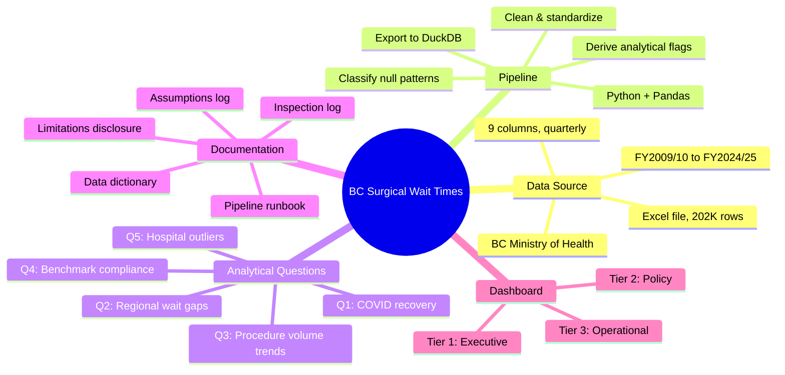
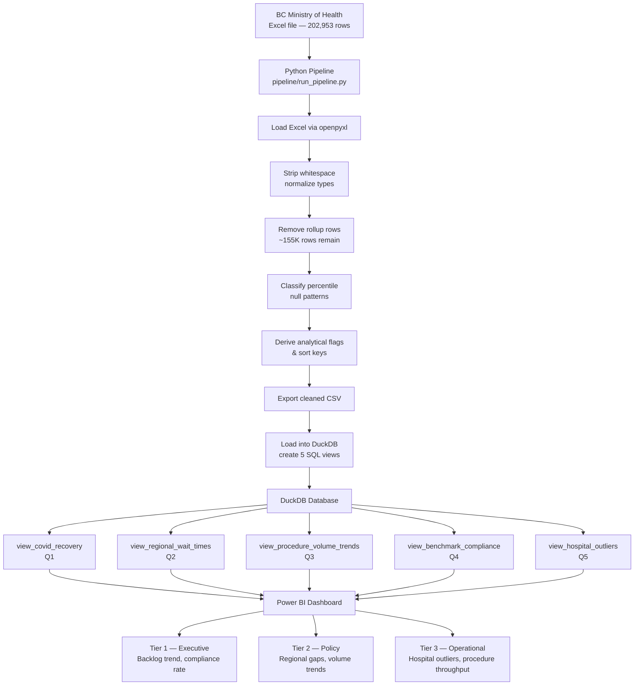
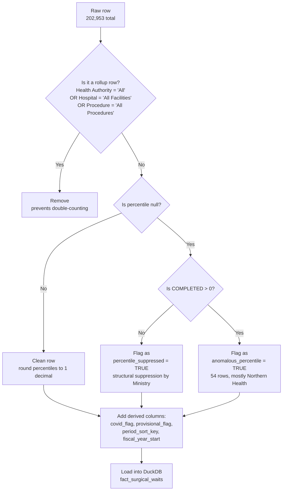
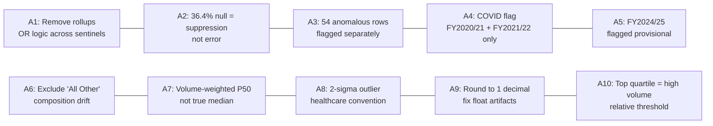
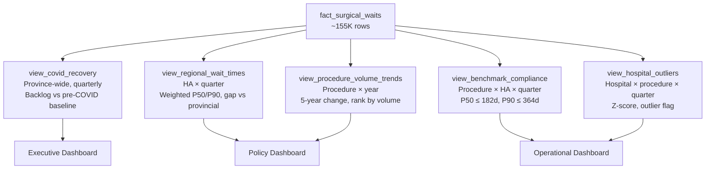

# BC Surgical Wait Times — Analytics Pipeline

End-to-end data pipeline and analytical layer for British Columbia's publicly published quarterly surgical wait times dataset. Covers FY2009/10 through FY2024/25 at facility and procedure level across all six regional health authorities and PHSA.

> **202,953 source rows · 66 hospitals · 85 procedure groups · 16 fiscal years · Python → DuckDB → Power BI**

---

## Why This Project Exists

BC's Ministry of Health publishes quarterly surgical wait time data under its commitment to public accountability. But the raw Excel file is not analysis-ready. It contains pre-aggregated rollup rows that cause double-counting, 36.4% of percentile values are structurally suppressed, and there is no built-in way to compare regions, track COVID recovery, or flag hospitals that fall outside normal performance ranges.

This project builds a reproducible analytical pipeline on top of that data: cleaning with documented reasoning, classifying data quality issues instead of hiding them, loading into a queryable database, and exposing five SQL views tied to specific policy and operational questions. The output drives a tiered Power BI dashboard designed for three distinct audiences.

---

## Project Mindmap



---

## Key Findings

Based on the analysis of 16 years of quarterly data:

- **The surgical backlog has not recovered post-COVID.** Total patients waiting province-wide remains above the FY2018/19 pre-COVID baseline. The waiting list crossed 350K around 2018/19, dropped during COVID-era deferrals (2020/21), and climbed back to approximately 300K by 2024/25 while completions lag behind.
- **Vancouver Coastal carries the highest average patient volumes** for both waiting and completed cases, followed by Vancouver Island and Fraser. Northern Health has the lowest volumes but this reflects population size, not necessarily better access.
- **The gap between waiting and completed is persistent across all regions.** Every health authority shows more patients waiting than being completed on average, meaning the backlog is not being drawn down, it is being maintained or growing.
- **The median wait (P50) sits at 8.62 days, but the P90 is 22.30 days.** This spread means most patients are seen within about a week, but the longest-waiting 10% wait nearly three times longer. That tail is where the real access problem lives.
- **Waiting and completed volumes both trend upward since 2009/10**, but waiting has grown faster, widening the gap over time. The line chart shows the two lines diverging steadily, with a visible disruption during COVID years.

---

## Dashboard Preview

### Executive Summary View

The full dashboard includes KPI cards (4M total completed, 5M total waiting, P90 and P50 averages), a regional comparison bar chart, and a fiscal year trend line showing waiting vs completed over time. Filters allow slicing by health authority and procedure group.


### Regional Comparison — Waiting vs Completed

Every health authority shows waiting volumes exceeding completed volumes on average. Vancouver Coastal has the largest absolute gap. Northern Health has the smallest volumes but the ratio of waiting to completed is still unfavorable.


---

## Architecture

### Pipeline Flow



### Data Cleaning Decision Flow



---

## Analytical Questions

The pipeline is structured around five specific questions. Each has a dedicated SQL view.

| # | Question | View | Dashboard Tier |
|---|----------|------|----------------|
| Q1 | Is BC's surgical backlog recovering post-COVID, and how does the current quarter compare to the pre-COVID baseline? | `view_covid_recovery` | Executive |
| Q2 | Which health authorities have the longest median wait times, and is the gap between regions widening or narrowing? | `view_regional_wait_times` | Policy |
| Q3 | Which procedure types have the highest patient volumes currently waiting, and how has that changed over five years? | `view_procedure_volume_trends` | Policy |
| Q4 | Are high-volume procedures meeting BC's provincial wait time benchmarks (P50 ≤ 182 days, P90 ≤ 364 days)? | `view_benchmark_compliance` | Operational |
| Q5 | Which hospitals are statistical outliers against the provincial average for the same procedure and quarter? | `view_hospital_outliers` | Operational |

---

## Dataset Scope

| Dimension | Coverage |
|-----------|----------|
| Fiscal years | FY2009/10 – FY2024/25 (16 years, quarterly) |
| Source rows | 202,953 |
| Rows after cleaning | ~155,000 (rollup rows removed) |
| Health authorities | 7 (Fraser, Interior, Northern, PHSA, Vancouver Coastal, Vancouver Island + provincial aggregate) |
| Hospitals | 66 |
| Procedure groups | 85 |

**Source:** BC Ministry of Health — Surgical Wait Times, Quarterly  
**Format:** Excel (.xlsx)  
**Expected location:** `data/raw/2009_2025-quarterly-surgical_wait_times-final.xlsx`

### Source Columns

| Column | Type | Nullable | Description |
|--------|------|----------|-------------|
| `FISCAL_YEAR` | String | No | BC fiscal year label, e.g. "2023/24" (April–March) |
| `QUARTER` | String | No | Q1 (Apr–Jun), Q2 (Jul–Sep), Q3 (Oct–Dec), Q4 (Jan–Mar) |
| `HEALTH_AUTHORITY` | String | No | One of six regional HAs or provincial aggregate |
| `HOSPITAL_NAME` | String | No | Specific facility or "All Facilities" aggregate |
| `PROCEDURE_GROUP` | String | No | One of 85 surgical procedure categories |
| `WAITING` | Integer | No | Patients on the wait list at quarter-end (snapshot, not cumulative) |
| `COMPLETED` | Integer | No | Surgeries completed within the quarter |
| `PERCENTILE_COMP_50TH` | Float | Yes | Median days from wait-list entry to surgery — completed cases only |
| `PERCENTILE_COMP_90TH` | Float | Yes | 90th percentile days — completed cases only |

### Derived Columns (added by pipeline)

| Column | Type | Derivation |
|--------|------|-----------|
| `fiscal_year_start` | Integer | First four characters of `FISCAL_YEAR` cast to integer. "2023/24" → 2023 |
| `quarter_number` | Integer | Q1→1, Q2→2, Q3→3, Q4→4 |
| `period_sort_key` | Integer | `fiscal_year_start × 10 + quarter_number`. Enables correct chronological ordering |
| `covid_flag` | Boolean | `TRUE` where `fiscal_year_start` ∈ {2020, 2021} |
| `provisional_flag` | Boolean | `TRUE` where `FISCAL_YEAR = "2024/25"` |
| `percentile_suppressed` | Boolean | `TRUE` where `PERCENTILE_COMP_50TH IS NULL`. Structural suppression — not imputed |
| `anomalous_percentile` | Boolean | `TRUE` where `COMPLETED > 0 AND PERCENTILE_COMP_50TH IS NULL`. Distinct from structural suppression |

---

## Data Cleaning Decisions

All cleaning decisions are fully documented with reasoning and invalidating conditions in `docs/assumptions_log.md`.

### Decision Map



| ID | Decision | Rationale |
|----|----------|-----------|
| A1 | Remove rollup rows using OR logic across all three sentinel values | Any partially-aggregated row causes double-counting if summed |
| A2 | Treat percentile nulls (36.4%) as structural suppression, not errors | BC suppresses percentiles when completed cases < ~5; null rate is stable across all 16 years |
| A3 | Flag 54 anomalous rows (`COMPLETED > 0` but percentile null) separately | These do not fit the suppression pattern; concentrated in specific Northern Health procedures |
| A4 | COVID flag covers FY2020/21 and FY2021/22 only; Q4 2019/20 excluded | Flagging Q4 2019/20 would contaminate the 2018/19 pre-COVID baseline |
| A5 | FY2024/25 flagged provisional for the entire fiscal year | File was last modified March 8, 2025; BC routinely revises prior quarters |
| A6 | "All Other Procedures" excluded from trend and compliance views | Its volume decline reflects reclassification into named groups, not real change |
| A7 | Volume-weighted average of P50 used as regional aggregate | A true median requires individual patient records we don't have |
| A8 | 2-sigma (z > 2.0) threshold for hospital outlier classification | Standard healthcare benchmarking convention; 1.5σ over-flags, 3σ misses systemic issues |
| A9 | Percentile columns rounded to 1 decimal place | Corrects floating-point artifacts from Excel without losing clinical precision |
| A10 | High-volume procedures defined as top quartile by WAITING in FY2023/24 | Relative quartile threshold is stable as system volume changes |

---

## Known Limitations

These apply to all findings. Full detail including per-chart disclosure requirements is in `docs/limitations_disclosure.md`.

| # | Limitation | Practical Implication |
|---|-----------|----------------------|
| L1 | P50/P90 measure **completed-case** wait times only | Patients still waiting are invisible; clearing short-wait cases first improves percentiles while long waiters accumulate |
| L2 | 36.4% of percentile values are suppressed | Regional averages over-represent high-volume facilities; true system-wide wait times are likely understated |
| L3 | Urgency mix not captured | Facilities that transfer urgent cases show shorter waits on paper; cross-facility comparisons are descriptive only |
| L4 | COVID years (2020/21, 2021/22) are not comparable | These reflect policy-driven deferrals, not system performance |
| L5 | FY2024/25 is provisional | Q4 2024/25 was incomplete at file modification date |
| L6 | Weighted average is not a true statistical median | Regional/provincial P50 figures are approximations |
| L7 | Z-score outlier method assumes normality | Healthcare wait distributions are right-skewed; low-volume hospitals may appear as outliers due to variance |
| L8 | No population denominator | Per-capita or age-standardised rates cannot be computed |
| L9 | No outcome data | This analysis measures access, not quality |
| L10 | Coding variation across facilities | Facilities may apply different conventions for wait-list entry dates and procedure classification |

---

## SQL Views Reference

All views operate on `fact_surgical_waits`. Views that use percentile data filter `percentile_suppressed = FALSE` before aggregating.

### How the views connect



### `view_covid_recovery`
**Question:** Is BC's surgical backlog recovering post-COVID?  
**Granularity:** Province-wide, quarterly  
Key columns: `total_waiting`, `total_completed`, `completion_rate_pct`, `baseline_avg_waiting_2018_19`, `waiting_vs_baseline_pct`

### `view_regional_wait_times`
**Question:** Which health authorities have the longest median wait times, and is the gap widening?  
**Granularity:** Health authority × quarter  
Key columns: `weighted_avg_p50`, `weighted_avg_p90`, `provincial_p50`, `gap_vs_provincial_p50_days`  
**Caveat:** Weighted average of P50 is not a true statistical median (see L6).

### `view_procedure_volume_trends`
**Question:** Which procedure types have the most patients waiting, and how has that changed?  
**Granularity:** Procedure group × fiscal year  
Key columns: `annual_waiting`, `annual_completed`, `waiting_5yr_change_pct`, `rank_by_waiting`

### `view_benchmark_compliance`
**Question:** Are high-volume procedures meeting BC's wait time targets?  
**Granularity:** Procedure × health authority × quarter  
Key columns: `p50_compliant`, `p90_compliant`, `fully_compliant`  
**Benchmarks:** P50 ≤ 182 days (26 weeks), P90 ≤ 364 days (52 weeks)

### `view_hospital_outliers`
**Question:** Which hospitals are statistical outliers versus the provincial average?  
**Granularity:** Hospital × procedure × quarter  
Key columns: `z_score_p50`, `outlier_flag`, `outlier_direction`  
**Caveat:** Always filter by `total_waiting > N` before interpreting. Small-volume hospitals generate extreme z-scores due to variance, not performance (see L7).

---

## Repository Structure

```
bc-surgical-wait-times/
│
├── data/                          # Not tracked in version control
│   ├── raw/                       # Source Excel file from BC Ministry of Health
│   ├── interim/                   # Cleaned CSV (generated by pipeline)
│   └── processed/                 # DuckDB database (generated by pipeline)
│
├── pipeline/
│   └── run_pipeline.py            # End-to-end pipeline orchestrator
│
├── sql/
│   └── views/
│       ├── view_covid_recovery.sql
│       ├── view_regional_wait_times.sql
│       ├── view_procedure_volume_trends.sql
│       ├── view_benchmark_compliance.sql
│       └── view_hospital_outliers.sql
│
├── powerbi/
│   └── Healthline.pbit            # Power BI template file
│
├── docs/
│   ├── images/
│   │   ├── dashboard_full.png     # Full dashboard screenshot
│   │   └── regional_comparison.png # Regional bar chart
│   ├── data_dictionary.md         # Column definitions, view documentation
│   ├── assumptions_log.md         # Every analytical decision with reasoning
│   ├── limitations_disclosure.md  # What this data cannot answer
│   ├── pipeline_runbook.md        # How to update for new quarterly releases
│   └── inspection_log.md          # Auto-generated data profile
│
├── .gitignore
├── requirements.txt
└── README.md
```

---

## How to Reproduce

### 1. Install dependencies
```bash
pip install -r requirements.txt
```
Requires Python 3.10 or later.

### 2. Obtain the source data
Download the latest quarterly surgical wait times Excel file from BC's Ministry of Health and place it at:
```
data/raw/2009_2025-quarterly-surgical_wait_times-final.xlsx
```

### 3. Run the pipeline
```bash
python -m pipeline.run_pipeline
```
The pipeline will load the Excel file, remove rollup rows (~155K remain), classify null patterns, derive flags, export a cleaned CSV, create the DuckDB database, and execute all five view definitions.

### 4. Validate (optional)
```sql
duckdb data/processed/surgical_wait_times.duckdb

-- Check province-wide quarterly totals
SELECT fiscal_year, quarter, total_waiting, total_completed
FROM view_covid_recovery
ORDER BY period_sort_key;

-- Check regional wait time gaps
SELECT health_authority, fiscal_year, quarter, 
       weighted_avg_p50, gap_vs_provincial_p50_days
FROM view_regional_wait_times
WHERE fiscal_year = '2023/24'
ORDER BY gap_vs_provincial_p50_days DESC;
```

### 5. Open Power BI
Open `powerbi/Healthline.pbit`, point the data source at `data/processed/surgical_wait_times.duckdb` (requires [DuckDB ODBC driver](https://duckdb.org/docs/api/odbc/overview)), and refresh.

---

## Updating for New Releases

When BC publishes a new quarterly file:

1. Replace the file in `data/raw/`
2. Verify the source schema still has the expected nine columns
3. Update `PROVISIONAL_FISCAL_YEAR` in the pipeline if a new fiscal year has become final
4. Rerun `python -m pipeline.run_pipeline`
5. Refresh Power BI

Full procedure in `docs/pipeline_runbook.md`.

---

## Benchmark Reference

| Metric | Threshold |
|--------|-----------|
| P50 (median) | ≤ 182 days (26 weeks) |
| P90 (90th percentile) | ≤ 364 days (52 weeks) |

These are BC's provincial surgical wait time targets for completed cases.

---

## Tech Stack

| Layer | Technology |
|-------|-----------|
| Data ingestion & cleaning | Python 3.10+, pandas, openpyxl |
| Analytical database | DuckDB |
| SQL views | DuckDB SQL |
| Dashboard | Power BI Desktop |
| Documentation | Markdown |

---

## Documentation Index

| File | Purpose |
|------|---------|
| `docs/data_dictionary.md` | Full column definitions, domain glossary, view documentation |
| `docs/assumptions_log.md` | All ten cleaning decisions with reasoning and invalidating conditions |
| `docs/limitations_disclosure.md` | What this data cannot answer; disclosure requirements by chart type |
| `docs/pipeline_runbook.md` | Step-by-step guide for updating with new quarterly releases |
| `docs/inspection_log.md` | Auto-generated data profile from initial load |

---

## What I Would Do Differently

If I had access to individual patient-level records instead of pre-aggregated quarterly data, I would compute true medians instead of volume-weighted approximations, segment by urgency level to make cross-facility comparisons meaningful, and build a predictive model for wait time forecasting by procedure and region. The current dataset measures access at a system level, but the real operational decisions happen at the patient and surgeon level, and that requires data this file does not contain.
